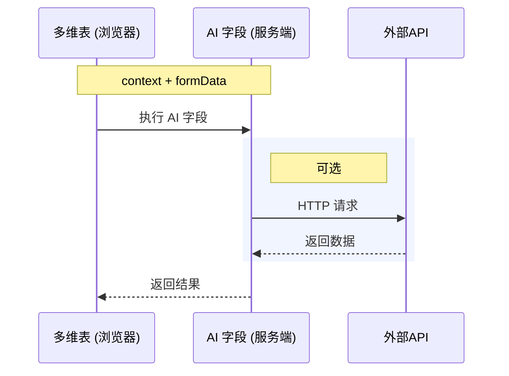

# AI表格 AI 字段开发指南（FaaS版）

Faas 类型的AI 字段支持通过代码，调用三方 API，灵活地实现自定义的业务功能。例如：你可以使用「发票识别」这个AI 字段，选择要识别的发票字段，通过 AI 的能力，提取出发票的内容。

# 基础介绍

AI 字段 FaaS 版是AI表格字段级开放能力，支持开发者将垂直场景的应用能力，融入AI表格构建的业务系统。

其支持通过代码，调用三方 API，灵活地实现自定义的业务功能。

对开发者而言，AI 字段插件本质是一个 Nodejs 函数。在执行时，会将当前行的指定字段数据作为输入，开发者执行自定义业务逻辑后，返回对应的单元格值。AI表格服务将单元格值实际写入AI表格，并渲染在用户界面中。

每一条记录的函数执行相互独立，仅支持获取当前行信息。



# 开发与发布

## 如何开发一个 FaaS AI 字段

### 1. 初始化AI 字段

在命令行执行下面命令克隆 Faas AI 字段代码

```typescript
git clone https://github.com/dingdocs-notable/field-decorator-demo
```

项目的目录结构为：

```typescript
field-decorator-demo
├── package.json
├── config.json // 本地调试授权时的配置文件
├── src
│   └── index.ts // 项目入口文件
└── tsconfig.json
```

接下来你就可以在 `index.ts`去实现 Faas AI 字段的 UI 配置和逻辑

## 如何调试 FaaS AI 字段

### 1. 启动本地服务

在刚刚克隆下面的仓库的根目录下执行下面命令：

```shell
# 进入 demo 文件夹
cd field-demo

# 安装依赖，只有第一次需要执行
npm install

# 如果上面的执行比较慢，可以将npm源切换为淘宝源
npm config set registry https://registry.npmmirror.com/

# 启动本地服务
npm run start
```

### 2. 打开AI 字段开发助手 

新建或打开任意钉钉AI表格格，点击`插件`展示插件面板，选择`AI 字段开发助手`


### 3. 开始 FaaS 调试


选中 FaaS 调试，且步骤一的本地服务已经启动的情况下，点击`添加字段`，则会出现AI 字段配置面板


通过「AI 字段开发助手」创建的字段，只支持在当前视图的第一行触发，并且需要保证「AI 字段调试助手」和「本地服务」处于运行状态。

chrome 最新版本禁止 https 访问 http，所以这里点击可能会提示：「添加失败，请检查本地服务是否启动」，可以通过下面方式启动一个关闭 chrome 此特性的实例：

mac：

```typescript
open -na "Google Chrome" --args --user-data-dir="/tmp/chrome_dev_test" --disable-web-security --disable-site-isolation-trials --disable-features=BlockInsecurePrivateNetworkRequests
```

windows：

```typescript
chrome.exe --disable-features=BlockInsecurePrivateNetworkRequests --disable-web-security --user-data-dir=C:\temp\chrome-dev
```

### 4. 模拟 FaaS 请求


在下拉框处`选择需要进行调试的 FaaS 字段`，点击`调试`

调试插件会模拟 FaaS 的行为，将你的`execute`函数执行结果写入AI表格。

目前仅支持本地模拟请求调试，只支持在当前视图的第一行触发，且不支持自动更新

## 如何发布 Faas AI 字段

填写「[钉钉AI表格AI 字段上架申请表单](https://alidocs.dingtalk.com/notable/share/form/v014j6OJ5jxepK0Eq3p_hERWDMS_Wqw4Upz)」，可发布给所有用户使用。

提交表单后，会有专员拉群沟通。

# AI 字段的结构

AI 字段主要由 `formItems`、`execute` 和 `resultType` 3 个属性组成，他们分别描述了插件的入参、实际的执行逻辑和返回结果。

| AI 字段属性 | 代码示例 | UI 示例 | 说明 |
| --- | --- | --- | --- |
| `formItems` | ```typescript<br>{<br>  // ...<br>  formItems: [<br>    {<br>      key: 'account',<br>      label: t('rmb'),<br>      component: FormItemComponent.FieldSelect,<br>      props: {<br>        mode: 'single',<br>        supportTypes: [FieldType.Number],<br>      },<br>      validator: {<br>        required: true,<br>      }<br>    },<br>  ],<br>}<br>``` |  | `formItems`描述了AI 字段的 UI 表单，AI 字段运行时，表单数据会作为 `execute` 参数的入参 |
| `resultType` | ```typescript<br>{<br>  // ...<br>  resultType: {<br>    type: FieldType.Number,<br>  },<br>}<br>``` |  | `resultType`描述了AI 字段的字段类型，例如 Text 表示结果是一列文本 |
| execute | ```typescript<br>{<br>  // ...<br>  execute: async (context, formData) => {<br>    return {<br>      code: FieldExecuteCode.Success,<br>      data: 123,<br>    };<br>  },<br>}<br>``` |  | AI 字段的运行函数 |

## 插件配置项 UI - formItems

`formItems`用于定义AI 字段的配置项 UI，并且可以负责接收用户实际配置的值

### 基础配置

**key**

配置项的 id，需要唯一，在 execute 执行时，需要根据 key 从 formData 中获取对应的值

**label**

配置项的名称，支持国际化

**component**

配置项组件，目前支持 Textarea、SingleSelect、MultiSelect、Radio、FieldSelect

**validator**

配置项是否必选

**tooltips**

配置项提示，支持国际化，使用示例如下：

```typescript
{
  // ...
  formItems: [
    {
      key: 'demo',
      label: '文本示例',
      component: FormItemComponent.Textarea,
      props: {
        placeholder: '请输入',
      },
      validator: {
        required: true,
      },
      tooltips: {
        title: 'tooltips'
      }
    },
  ],
}
```

如果希望里面有链接，可以这样配置

```typescript
{
  // ...
  formItems: [
    {
      key: 'demo',
      label: '文本示例',
      component: FormItemComponent.Textarea,
      props: {
        placeholder: '请输入',
      },
      validator: {
        required: true,
      },
      tooltips: {
        title: [
          {
            type: "text",
            text: "普通文本"
          },
          {
            type: "link",
            text: "链接文本",
            url: "跳转链接"
          }
        ]
      }
    },
  ],
}
```

### Textarea 组件

多行文本输入组件，用户可手动输入，`props`支持以下参数

| 参数 | 类型 | 说明 |
| --- | --- | --- |
| placeholder | string | 输入框提示文字 |
| enableFieldReference | boolean | 是否支持引用字段 |


|  | 类型 | 说明 |
| --- | --- | --- |
| execute 函数入参 | string | 使用 `Textarea` 组件，AI表格格会传递字符串给`execute`函数 |

**代码示例**

```typescript
{
  // ...
  formItems: [
    {
      key: 'demo',
      label: '文本示例',
      component: FormItemComponent.Textarea,
      props: {
        placeholder: '请输入',
      },
      validator: {
        required: true,
      }
    },
  ],
  resultType: {
    type: FieldType.Text,
  },
  execute: async (context, formData) => {
    const str = formData.demo;
    return {
      code: FieldExecuteCode.Success,
      data: str,
    };
  },
}
```

### SingleSelect 组件

下拉单选组件，用户手动选择下拉项里的值，`props` 支持以下参数

| 参数 | 类型 | 说明 |
| --- | --- | --- |
| placeholder | string | 输入框提示文字 |
| options | Array<{<br>    key: string;<br>    title: string;<br>  }> | 选项数据，其中为`title`展示文案，`key`为实际值 |
| defaultValue | string | 初始值，为 options 里某一项的 key |


|  | 类型 | 说明 |
| --- | --- | --- |
| execute 函数入参 | string | 使用 `SingleSelect` 组件，AI表格格会传递「所选配置项的 `key`」给`execute`函数 |

**代码示例**

```typescript
{
  // ...
  formItems: [
    {
      key: 'demo',
      label: '单选示例',
      component: FormItemComponent.SingleSelect,
      props: {
        defaultValue: 'option1',
        placeholder: "请选择",
        options: [
          {
            key: "option1",
            title: "选项1"
          },
          {
            key: "option2",
            title: "选项2"
          }
        ]
      },
      validator: {
        required: true,
      }
    },
  ],
  resultType: {
    type: FieldType.Text,
  },
  execute: async (context, formData) => {
    const key = formData.demo;
    return {
      code: FieldExecuteCode.Success,
      data: key,
    };
  },
}
```

### MultiSelect 组件

下拉多选组件，用户手动选择下拉项里的值，`props` 支持以下参数

| 参数 | 类型 | 说明 |
| --- | --- | --- |
| placeholder | string | 输入框提示文字 |
| options | Array<{<br>    key: string;<br>    title: string;<br>  }> | 选项数据，其中`title`为展示文案，`key`为实际值 |
| defaultValue | string\[\] | 初始值，每一项由 options 里的 key 组成 |


|  | 类型 | 说明 |
| --- | --- | --- |
| execute 函数入参 | Array<string> | 使用 `MultiSelect` 组件，AI表格格会传递「所选配置项的 `key`数组」给`execute`函数 |

**代码示例**

```typescript
{
  // ...
  formItems: [
    {
      key: 'demo',
      label: '多选示例',
      component: FormItemComponent.MultiSelect,
      props: {
        defaultValue: ['option1'],
        placeholder: "请选择",
        options: [
          {
            key: "option1",
            title: "选项1"
          },
          {
            key: "option2",
            title: "选项2"
          },
          {
            key: "option3",
            title: "选项3"
          }
        ]
      },
      validator: {
        required: true,
      }
    },
  ],
  resultType: {
    type: FieldType.Text,
  },
  execute: async (context, formData) => {
    const keyArray = formData.demo;
    return {
      code: FieldExecuteCode.Success,
      data: keyArray.join(','),
    };
  },
}
```

### Radio 组件

单选框组件，`props` 支持以下参数

| 参数 | 类型 | 说明 |
| --- | --- | --- |
| options | Array<{<br>    value: string;<br>    label: string;<br>  }> | 选项数据，其中`label`为展示文案，`value`为实际值 |
| defaultValue | string | 初始值，为 options 里某一项的 value |


|  | 类型 | 说明 |
| --- | --- | --- |
| execute 函数入参 | string | 使用 `Radio` 组件，AI表格格会传递「所选配置项的 `value`」给`execute`函数 |

**代码示例**

```typescript
{
  // ...
  formItems: [
    {
      key: 'demo',
      label: '单选框示例',
      component: FormItemComponent.Radio,
      props: {
        defaultValue: 'option1',
        options: [
          {
            value: "option1",
            label: "选项1"
          },
          {
            value: "option2",
            label: "选项2"
          }
        ]
      },
      validator: {
        required: true,
      }
    },
  ],
  resultType: {
    type: FieldType.Text,
  },
  execute: async (context, formData) => {
    const key = formData.demo;
    return {
      code: FieldExecuteCode.Success,
      data: key,
    };
  },
}
```

### FieldSelect 组件

字段选择组件，`props` 支持以下参数

| 参数 | 类型 | 是否必填 | 说明 |
| --- | --- | --- | --- |
| mode | 'single' \| 'multiple' | 否 | 单选 or 多选 |
| supportTypes | SupportTypes | 否 | 支持哪些字段类型，比如 \[FieldType.Text\]则只能选文本字段 |

目前支持如下类型：

```typescript
// 目前可支持字段类型：1.文本字段｜2.数字字段｜3.单选字段｜4.多选字段｜5.链接字段｜6.附件字段 
type SupportTypes = (
  FieldType.Text | 
  FieldType.Number | 
  FieldType.SingleSelect | 
  FieldType.MultiSelect | 
  FieldType.Link | 
  FieldType.Attachment
)[];
```


**代码示例**

```typescript
{
  // ...
  formItems: [
    {
      key: 'demo',
      label: '字段选择示例',
      component: FormItemComponent.FieldSelect,
      props: {
        mode: 'single',
        supportTypes: [FieldType.Text, FieldType.Number],
      },
      validator: {
        required: true,
      }
    },
  ],
  execute: async (context, formData) => {
    const value = formData.demo;
    return {
      code: FieldExecuteCode.Success,
      data: value,
    };
  },
}
```

选择不同类型的字段，会传递给不同类型的值给`execute`函数，以下是各种类型字段的`execute 函数入参`

#### 文本字段

|  | 类型 | 说明 |
| --- | --- | --- |
| execute 函数入参 | string | 选择`FieldType.Text`字段类型，会传递「所选字段列的文本内容」给`execute`函数 |

```typescript
// execute 函数入参类型
type TextFieldValue = string;

{
  // ...
  execute: async (context, formData) => {
    const value = formData.demo as TextFieldValue;
    return {
      code: FieldExecuteCode.Success,
      data: value,
    };
  },
}
```

#### 数字字段

|  | 类型 | 说明 |
| --- | --- | --- |
| execute 函数入参 | number | 选择`FieldType.Number`字段类型，会传递「所选字段列的数值」给`execute`函数 |

```typescript
// execute 函数入参类型
type NumFieldValue = number;

{
  // ...
  execute: async (context, formData) => {
    const value = formData.demo as NumFieldValue;
    return {
      code: FieldExecuteCode.Success,
      data: value,
    };
  },
}
```

#### 单选字段

|  | 类型 | 说明 |
| --- | --- | --- |
| execute 函数入参 | string | 选择`FieldType.SingleSelect`字段类型，会传递「所选字段列对应的选项值」给`execute`函数 |

```typescript
// execute 函数入参类型
type SingleSelectFieldValue = string;

{
  // ...
  execute: async (context, formData) => {
    const value = formData.demo as SingleSelectFieldValue;
    return {
      code: FieldExecuteCode.Success,
      data: value,
    };
  },
}
```

#### 多选字段

|  | 类型 | 说明 |
| --- | --- | --- |
| execute 函数入参 | string\[\] | 选择`FieldType.MultiSelect`字段类型，会传递「所选字段列对应的选项值数组」给`execute`函数 |

```typescript
// execute 函数入参类型
type MultiSelectFieldValue = string[];

{
  // ...
  execute: async (context, formData) => {
    const value = formData.demo as MultiSelectFieldValue;
    return {
      code: FieldExecuteCode.Success,
      data: value,
    };
  },
}
```

#### 链接字段

|  | 类型 | 说明 |
| --- | --- | --- |
| execute 函数入参 | LinkFieldValue | 选择`FieldType.Link`字段类型，会传递「链接相关信息」给`execute`函数 |

```typescript
// execute 函数入参类型
type LinkFieldValue = {
  url: string, // 链接地址
  text: string // 链接描述
};

{
  // ...
  execute: async (context, formData) => {
    const value = formData.demo as LinkFieldValue;
    return {
      code: FieldExecuteCode.Success,
      data: value,
    };
  },
}
```

#### 附件字段

|  | 类型 | 说明 |
| --- | --- | --- |
| execute 函数入参 | Array<Attachment> | 选择`FieldType.Attachment`字段类型，会传递「附件相关的信息」给`execute`函数 |

```typescript
// execute 函数入参类型
type Attachment = {
  name: string; // 附件名字
  type: string; // 附件类型
  size: number; // 附件大小
  tmp_url: string; // 附件链接
}
type AttachmentFieldValue = Array<Attachment>;

{
  // ...
  execute: async (context, formData) => {
    const value = formData.demo as AttachmentFieldValue;
    return {
      code: FieldExecuteCode.Success,
      data: value,
    };
  },
}
```

## 插件返回结果 - resultType

`resultType`定义了AI 字段返回值的类型，注意：`**resultType**` **中声明的类型需要和** `**execute**` **函数返回的类型一致，否则校验不通过，数据不会写入到AI表格**

### Text

返回文本数据

| 属性 | 值 | 是否必填 | 说明 |
| --- | --- | --- | --- |
| type | FieldType.Text | 是 | 声明返回为文本字段 |

execute 返回值类型： `string`

**示例**

```typescript
{
  resultType: {
    type: FieldType.Text,
  },
  execute: async (context, formItemParams: any) => {
    return {
      code: FieldExecuteCode.Success,
      data: 'string', // data必须为字符串
    };
  }
}

```

### Number

返回数字数据

| 属性 | 值 | 是否必填 | 说明 |
| --- | --- | --- | --- |
| type | FieldType.Number | 是 | 声明返回为文本字段 |

execute 返回值类型： `number`

**示例**

```typescript
{
  resultType: {
    type: FieldType.Text,
  },
  execute: async (context, formItemParams: any) => {
    return {
      code: FieldExecuteCode.Success,
      data: 123,
    };
  }
}

```

### SingleSelect

返回单选，类型如下：

| 属性 | 值 | 是否必填 | 说明 |
| --- | --- | --- | --- |
| type | FieldType.SingleSelect | 是 | 声明返回为单选字段 |
| extra | object | 是 | 单选字段 |
| extra.options | Array<{ name: string }> | 是 | 单选字段的选项 |

execute 返回值类型：`string`

**示例**

```typescript
{
  resultType: {
    type: FieldType.SingleSelect,
    extra: {
      options: [
        {
          name: '选项1'
        },
        {
          name: '选项2'
        }
      ]
    }
  },
  execute: async (context, formItemParams: any) => {
    return {
      code: FieldExecuteCode.Success,
      data: '选项1',
    };
  }
}
```

### MultiSelect

返回多选，类型如下：

| 属性 | 值 | 是否必填 | 说明 |
| --- | --- | --- | --- |
| type | FieldType.MultiSelect | 是 | 声明返回为多选字段 |
| extra | object | 是 | 多选字段 |
| extra.options | Array<{ name: string }> | 是 | 多选字段的选项 |

execute 返回值类型：`Array<string>`

**示例**

```typescript
{
  resultType: {
    type: FieldType.MultiSelect,
    extra: {
      options: [
        {
          name: '选项1'
        },
        {
          name: '选项2'
        }
      ]
    }
  },
  execute: async (context, formItemParams: any) => {
    return {
      code: FieldExecuteCode.Success,
      data: ['选项1', '选项2'],
    };
  }
}
```

### Link

返回链接数据

| 属性 | 值 | 是否必填 | 说明 |
| --- | --- | --- | --- |
| type | FieldType.Link | 是 | 声明返回为链接字段 |

execute 返回值类型：

| 属性 | 值 | 是否必填 | 说明 |
| --- | --- | --- | --- |
| text | string | 是 | 链接文本 |
| link | string | 是 | 链接值 |

**示例**

```typescript
{
  resultType: {
    type: FieldType.Link,
  },
  execute: async (context, formItemParams: any) => {
    return {
      code: FieldExecuteCode.Success,
      data: {
        text: 'link text',
        link: 'https://link.url'
      },
    };
  }
}
```

### Attachment

返回附件，类型如下：

| 属性 | 值 | 是否必填 | 说明 |
| --- | --- | --- | --- |
| type | FieldType.Attachment | 是 | 声明返回为附件字段 |

execute 返回值类型：

| 属性 | 值 | 是否必填 | 说明 |
| --- | --- | --- | --- |
| fileName | string | 是 | 附件名称 |
| type | string | 是 | 附件类型 |
| url | string | 是 | 附件地址，需要公开可访问 |

**示例**

```typescript
{
  resultType: {
    type: FieldType.Attachment,
  },
  execute: async (context, formItemParams: any) => {
    return {
      code: FieldExecuteCode.Success,
      data: [{
        fileName: '测试附件.png',
        type: 'image',
        url: 'https://attachment.url'
      }],
    };
  }
}
```

### Object

返回Object，类型如下：

| 属性 | 值 | 是否必填 | 说明 |
| --- | --- | --- | --- |
| type | FieldType.Object | 是 | 声明返回为Object字段 |
| extra | object | 是 | 多选字段 |
| extra.properties | object\[\] | 是 | Object 字段的属性 |
| extra.icon | {<br>    light: string;<br>    dark?: string;<br> } | 否 | Object 字段的图标 |

其中 extra.properties 支持以下配置

| 属性 | 值 | 是否必填 | 说明 |
| --- | --- | --- | --- |
| key | string | 是 | Object 属性字段的 key，会从 execute 返回值中取值，例如：execute 返回值为 data，则这个字段的值为 data\[key\] |
| type | FieldType.Text | 是 | Object 属性字段类型，目前只支持文本类型 |
| title | string | 是 | Object 属性字段的名称 |
| primary | boolean | 否 | 标记该属性为用于排序的主属性。注意：<br>`properties` 数组中必须有一个 `primary` 值为`true`表示主属性，且不能被隐藏。如果不满足这个限制，则不会更新 object 字段 |
| hidden | boolean | 否 | 是否在字段面板中隐藏该字段 |

execute 返回值类型：`object`

**示例**

```typescript
{
  resultType: {
    type: FieldType.Object,
    properties: [
      {
        key: 'prop1',
        type: FieldType.Text,
        title: '属性1',
        primary: true
      },
      {
        key: 'prop2',
        type: FieldType.Text,
        title: '属性2',
        primary: true
      }
    ],
    icon: {
      light: 'https://iconlight.png'
    }
  },
  execute: async (context, formItemParams: any) => {
    return {
      code: FieldExecuteCode.Success,
      data: {
        prop1: 'prop1 value',
        prop2: 'prop2 value'
      },
    };
  }
}
```

## 插件执行函数 - execute

execute 是AI 字段实际的业务逻辑，目前仅支持 Nodejs 运行时。

### 入参

| 参数 | 类型 | 说明 |
| --- | --- | --- |
| context | Context | 每次执行的上下文，详见下方定义。 |
| formData | object | 实际运行时，用户在 UI 组件上配置的参数。<br>*   该对象的参数和 formItems 中的 key 保持一致<br>    <br>*   value 与 formItems 中定义的组件返回值一致，如果是字段选择，会将当前行此字段的单元格值返回。<br>    <br>```typescript<br>{<br>    "textKey": "文本值",<br>    "numberKey": 1.23,<br>}<br>``` |

### context 定义

context 是 Faas 函数运行时的上下文信息

| 参数 | 类型 | 示例值 | 说明 |
| --- | --- | --- | --- |
| fetch | (url, options) => Promise<Response> |  | 请求外部数据的 API，语法参考：[node-fetch](https://github.com/node-fetch/node-fetch) |
| baseId | string |  | AI表格格唯一标识 |
| sheetId | string |  | 数据表 id |
| extensionId | string |  | AI 字段唯一标识 |
| tenantId | string |  | 租户 id |
| logId | string |  | 日志 id，可以根据这个去查询数据 |

### 返回值

`execute` 必须要有一个返回值，其中 `code`表示运行结果，`msg` 表示异常信息，`data` 表示数据

| 属性 | 类型 | 说明 |
| --- | --- | --- |
| `code` | `FieldExecuteCode` | `execute` 执行结果，具体值见下方 `FieldExecuteCode` 定义 |
| `data` | `object` | 返回的数据，需要和 `resultType` 保持一致，支持的结果见上面章节：[《AI表格 AI 字段开发指南（FaaS版）》](https://alidocs.dingtalk.com/i/nodes/1R7q3QmWeljPoM5BSGPbvaNO8xkXOEP2?utm_scene=team_space&iframeQuery=anchorId%3Duu_mc35kwg2setdj2qkqw) |
| `errorMessage` | `string` | 详细错误信息，仅在 `code` 为`FieldExecuteCode.Error` 时才生效 |

`FieldExecuteCode`

| code 值 | 含义 |
| --- | --- |
| FieldExecuteCode.Success | 运行成功 |
| FieldExecuteCode.Error | 通用的插件运行失败 |
| FieldExecuteCode.RateLimit | 限流 |
| FieldExecuteCode.QuotaExhausted | quota 耗尽 |
| FieldExecuteCode.ConfigError | 配置错误，即用户在配置面板选择的值不合法可以返回该错误码 |
| FieldExecuteCode.InvalidArgument | 参数错误，即用户所选配置的内容合法，但是代码中未兼容等情况 |
| FieldExecuteCode.AuthorizationError | 授权错误，即用户配置的账户不合法 |

### 自定义错误信息

如果默认的错误提示不满足需求，可以通过`errorMessage`来自定义错误提示，注意：**仅在** `**code**` **为**`**FieldExecuteCode.Error**` **时才生效，**建议尽量使用内置的错误码

为了支持国际化，需要搭配`errorMessages`使用，具体逻辑是 `execute` 返回 `errorMessage`，例如 error，最终用户看到的是`errorMessages`中 对应的值，即 error 这个 key 对应的值，支持引用国际化资源，参考代码如下：

```typescript
{
  i18nMap: {
    'zh-CN': {
      // 定义国际化资源
      'errorTips': '错误提示',
    },
    'en-US': {
      'errorTips': '',
    },
    'ja-JP': {
      'errorTips': '',
    },
  },
  errorMessages: {
    // 定义错误信息集合
    'error1': t('errorTips1'),
    'error2': t('errorTips2')
  }
  execute: async (context, formItemParams: any) => {
    return {
      code: FieldExecuteCode.Error,
      // 返回的值需要在errorMessages中存在
      errorMessage: 'error1',
    };
  }
}
```

### 自定义错误上下文

AI 字段执行错误时，用户会看到错误信息并且可以复制错误信息，交由开发者去排查错误原因，开发者可以通过自定义错误上下文来排查问题，例如添加业务的 traceid，这样用户复制的错误信息里面就会有 traceid，使用方式如下：

```typescript
{
  execute: async (context, formItemParams: any) => {
    return {
      code: FieldExecuteCode.Error,
      // 类型：Record<string, string>
      // 这里只是添加traceid的示例，实际上可以添加任何信息
      // 但是建议信息尽量简短，能排查问题即可
      extra: {
        traceid: 'xxxx'
      },
    };
  }
}
```

此时用户复制的错误信息就会是下面的内容：

```typescript
生成失败

AI 字段运行错误，请联系插件开发者

基础信息:
Sheet ID: xx
Record ID: xx
Field ID: xx
Task ID: xx
// 此处就是上面新增的信息
traceid: xxxx
```

### 域名白名单

`execute` 函数调用外部 API 时，需要先声明白名单，否则请求会被拒绝，其中白名单配置规则如下：

*   域名需要包含主机名，例如 example.com
    
*   域名支持使用 IP 地址（支持 IPV4 和 IPV6）
    
*   不支持配置端口
    
*   仅支持配置域名，带上协议、路径会导致匹配失败
    

示例如下：

```tsx
fieldDecoratorKit.setDomainList(['example.com']); // 可以打开 https://doc.example.com, https://img.example.com

fieldDecoratorKit.setDomainList(['192.168.1.1']); // 可以打开 http://192.168.1.1:{{port}}，其中任意端口号都可以访问

fieldDecoratorKit.setDomainList(['https://example.com']); // ❌带上了协议会导致无法正确识别域名

fieldDecoratorKit.setDomainList(['example.com/path']); // ❌带上了路径会导致无法正确识别域名
```

### 运行环境

| 参数 | 详情 |
| --- | --- |
| Node.js 版本 | 16.x |
| 单实例规格 | 1 核 1G |
| 超时时间 | 15 分钟 |
| 服务隔离 | 按照插件 + 组织的维度隔离 |
| 扩缩容 | 支持动态扩缩容，最大 n 个实例 |

运行环境限制：

1.  请求的并发数不超过 10n
    
2.  以下三方库无法在沙箱内运行
    
    1.  axios
        
    2.  got
        
    3.  bcrypt
        
    4.  moment
        
    5.  jsdom
        
    6.  sharp
        
    7.  crypto（使用 crypto-js 替代）
        
3.  以下全局对象是由沙箱注入，如果你依赖这些对象的原型链做判断时，可能会出现预期外的结果
    
    1.  URL
        
    2.  Buffer
        
    3.  Uint8Array
        
    4.  URLSearchParams
        

## 授权

授权不是AI 字段的必选项，取决于AI 字段是否依赖其他三方平台的凭证。如果依赖三方平台的凭证，强烈建议通过授权的方式来保存凭证，保护用户的数据安全。

### APIKey 授权模式

目前AI 字段支持以下几种 APIKey 授权模式。注意：**授权模式不支持向下兼容，例如从没有授权到配置了授权，需要开发者关注并且做好兼容**

### 使用

**HeaderBearToken**

**介绍**

用户输入 APIKey 后，AI 字段框架在请求时会在 header 中带上请求头

```JavaScript
Authorization: Bearer APIKey
```

服务端接收到的请求示例：

```JSON
{
  headers:{
    authorization: "Bearer AAAAAA"
  }
}
```

**使用**

代码示例：

```typescript
fieldDecoratorKit.setDecorator({
  authorizations: 
    {
      id: 'auth_id',// 授权的id，用于context.fetch第三个参数指定使用
      platform: 'xxx',// 授权平台，目前可以填写当前平台名称
      type: AuthorizationType.HeaderBearerToken, // 授权类型
      required: false,// 设置为选填，用户如果填了授权信息，请求中则会携带授权信息，否则不带授权信息
      instructionsUrl: "https://xxx",// 帮助链接，告诉使用者如何填写这个apikey
      label: '测试授权', // 授权平台，告知用户填写哪个平台的信息
      tooltips: '请配置授权', // 提示，引导用户添加授权
      /**
      * 也支持配置链接
      **/
      icon: { // 当前平台的图标
        light: '', 
        dark: ''
      }
    }
  ,
  execute: async (params, context) => {
    const url = 'https://xxx';// 已经在setDomainList中添加为白名单的请求
    // 通过指定context.fetch第3个参数为授权id： auth_id。则会在请求头带上 Authorization: Bearer APIKey
    const res = await context.fetch(url, {
      method: 'POST',
    }, 'auth_id');// 第三个参数为某个授权的id
  }
});
```

为了用户能更容易上手配置，建议 tooltips 里面直接配置好使用文档

```tsx
fieldDecoratorKit.setDecorator({
  authorizations: 
    {
      tooltips: [
        {
          type: "text",
          text: "普通文本"
        },
        {
          type: "link",
          text: "链接文本",
          url: "跳转链接"
        }
      ]
    }
  ,
});
```

**本地调试**

用户授权的信息是由AI表格代为保存的，所以在本地调试阶段，不支持解密用户的授权信息，我们提供了本地 mock 的方式来调试，具体使用如下：

在根目录/config.json中设置mock值以进行本地调试，示例：

```typescript
{
  "authorizations": "token"
}
```

在 execute 中使用方式不变

```typescript
fieldDecoratorKit.setDecorator({
  execute: async (params, context) => {
    const url = 'https://xxx';// 已经在setDomainList中添加为白名单的请求
    // 通过指定context.fetch第3个参数为授权id： auth_id。则请求时会自动添加header
    const res = await context.fetch(url, {
      method: 'POST',
    }, 'auth_id');// 第三个参数为某个授权的id
  }
});
```

此时服务端收到的请求为：

```typescript
{
  headers:{
    authorization: "Bearer token"
  }
}
```

**MultiHeaderToken**

**介绍**

用户可以输入多个key，AI 字段框架会在你请求时带上请求头。

服务端接收到的请求示例：

```JSON
"body": "",
"headers":{
    "content-length": "0",
    "id-a": "AAAAAA",
    "id-b": "BBBBBBB"
},
"url": "....."

```

**使用**

代码示例：

```typescript
fieldDecoratorKit.setDecorator({
  authorizations: 
    {
      id: 'auth_id',// 授权的id，用于context.fetch第三个参数指定使用
      platform: 'xxx',// 授权平台，目前可以填写当前平台名称
      type: AuthorizationType.MultiHeaderToken, // 授权类型
      // 用户可以填写的key
      params: [
        { key: "id-a", placeholder: "id-a" },
        { key: "id-b", placeholder: "id-b" },
      ],
      required: false,// 设置为选填，用户如果填了授权信息，请求中则会携带授权信息，否则不带授权信息
      instructionsUrl: "https://xxx",// 帮助链接，告诉使用者如何填写这个apikey
      label: '测试授权', // 授权平台，告知用户填写哪个平台的信息
      tooltips: '请配置授权', // 提示，引导用户添加授权
      // 当前平台的图标
      icon: {
        light: '', 
        dark: ''
      }
    }
  ,
  execute: async (params, context) => {
    const url = 'https://xxx';// 已经在setDomainList中添加为白名单的请求
    // 通过指定context.fetch第3个参数为授权id： auth_id，则请求时会自动添加header
    const res = await context.fetch(url, {
      method: 'POST',
    }, 'auth_id');// 第三个参数为某个授权的id
  }
});
```

**本地调试**

用户授权的信息是由AI表格代为保存的，所以在本地调试阶段，不支持解密用户的授权信息，我们提供了本地 mock 的方式来调试，具体使用如下：

在根目录/config.json中设置mock值以进行本地调试，示例：

```typescript
{
  "authorizations": {
      "id-a": "AAAAAA",
      "id-b": "BBBBBBB"
    }
}
```

在 execute 中使用方式不变

```typescript
fieldDecoratorKit.setDecorator({
  execute: async (params, context) => {
    const url = 'https://xxx';// 已经在setDomainList中添加为白名单的请求
    // 通过指定context.fetch第3个参数为授权id： auth_id。则会在请求头带上 Authorization: Bearer APIKey
    const res = await context.fetch(url, {
      method: 'POST',
    }, 'auth_id');// 第三个参数为某个授权的id
  }
});
```

此时服务端收到的请求为：

```typescript
{
  headers:{
    "id-a": "AAAAAA",
    "id-b": "BBBBBBB"
  }
}
```

## 国际化

在 json 中，可以通过`i18nMap`来定义插件文案 key 的映射关系，在需要消费文案的位置，使用`t(文案 key)`这样的方式使用。目前仅支持中文（zh-CN）、英文（en-US）、日文（ja-JP），如果当前的语言不属于这三种，则会默认使用中文的语言资源。

参考示例如下：

```typescript
import { FieldType, fieldDecoratorKit, FormItemComponent, FieldExecuteCode } from 'dingtalk-docs-cool-app';
const { t } = fieldDecoratorKit;

fieldDecoratorKit.setDecorator({
  //...
  // 定义国际化语言资源
  i18nMap: {
    'zh-CN': {
      'link': '请选择需要 AI 爬取信息的链接所在字段',
      'promptLabel': '请输入要求/提示',
      'prompPlaceholder': '尽可能描述清楚你需要 AI 理解什么内容',
    },
    'en-US': {
      'link': 'Please select the field where the link is located',
      'promptLabel': 'Please enter a prompt',
      'prompPlaceholder': 'Please describe what you need AI to understand',
    },
    'ja-JP': {
      'link': 'AIクロール情報が必要なリンクフィールドを選択してください',
      'promptLabel': 'リクエスト/プロンプトを入力してください',
      'prompPlaceholder': 'AIに理解させたいことをできるだけ具体的に記述する',
    },
  },
  // 定义捷径的入参
  formItems: [
    {
      key: 'link',
      label: t('link'),
      //...
    },
    {
      key: 'prompt',
      label: t('promptLabel'),
      props: {
        placeholder: t('prompPlaceholder'),
      },
      //...
    },
  ],
  //...
});
```